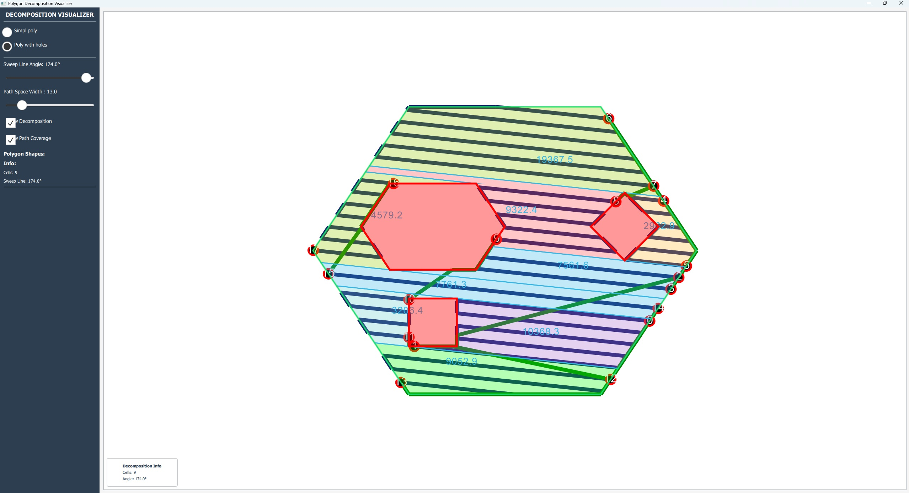

# Описание архитектуры CellularPathGenerator

## Обзор
Проект CellularPathGenerator выполняет генерацию ячеек внутри полигона с учётом отверстий (holes) и покрытие траекторией.

синии лини - основная траектория движения;

красные линии - соединения движения между ячеками

## Основные компоненты

### 1. **Класс PolyBuilder**
- Работает с библиотекой **Clipper2** (https://angusj.com/clipper2/).
- Выполняет полигональные операции (обрезка, объединение, пересечение).
- Подготавливает данные для класса **Decomposer**.

### 2. **Класс Decomposer**
Реализует алгоритм декомпозиции полигона на ячейки (cells).

#### Алгоритм Decomposer:
1. **Предобработка**: получение длинных линий holes до пересечений с ограничивающим прямоугольником SurvPoly.
2. **Организация данных**: создание структуры с формированием новых границ U и D на основе отверстий.
3. **Поиск пересечений**: для линий ParallelSweepL и ParallelSweepR из с границами Polygon и Polygon Holes.
4. **Сортировка**: выбор пересечений с кратчайшим расстоянием.
5. **Формирование зон**: создание ячеек.

### 3. **Класс PathGenerator**
Генерирует путь внутри каждой ячейки, полученной от Decomposer.

#### Этапы PathGenerator:
1. Определение пересечений с отверстиями и границей SurvPoly.
2. Задание направления движения "змейкой".
3. Конфигурация пути внутри ячейки с добавлением граничных точек и упорядочиванием по кратчайшим соединениям.

### 4. **Класс PathFinderCalculator**
Находит пути между ячейками.  
Использует алгоритм **A***, который является ресурсоёмким.  
Планируется заменить на более простой метод, основанный на пересечениях.

### 5. **Заголовочный файл utilz.h**
Содержит вспомогательные функции для работы с границами и линиями:
- Формирование границ.
- Обработка линий.
- Функция `extraDangerPointsRoutine` для расчёта дополнительных контрольных точек.
